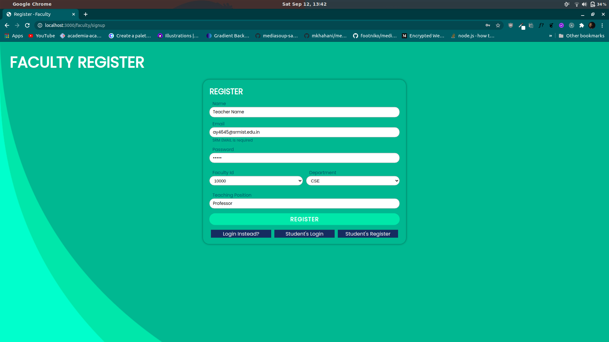
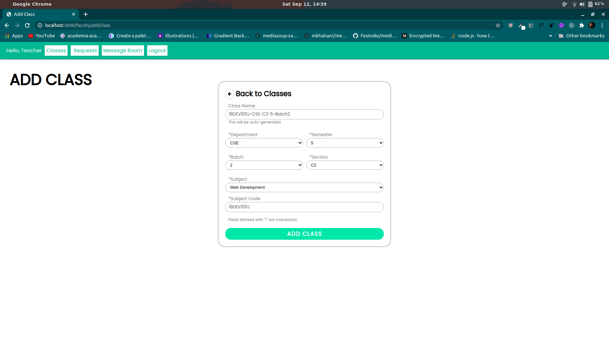
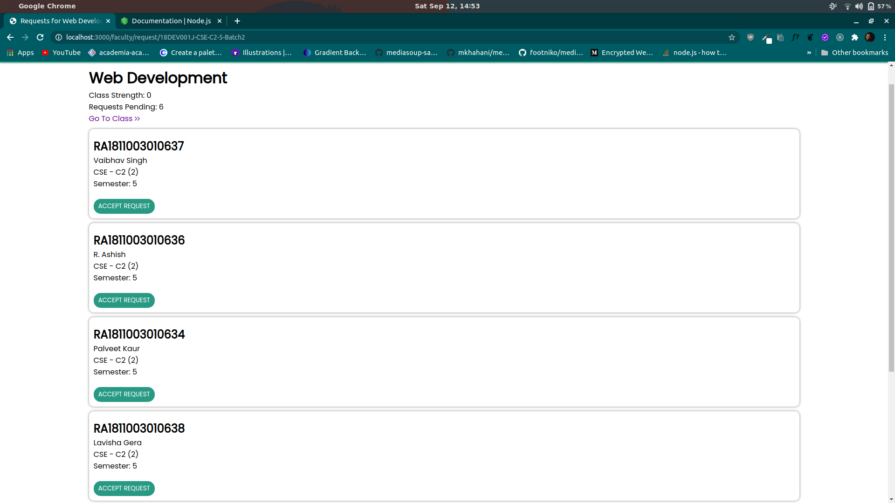
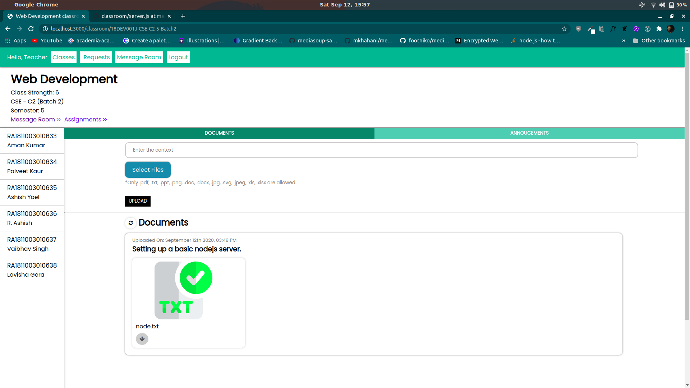
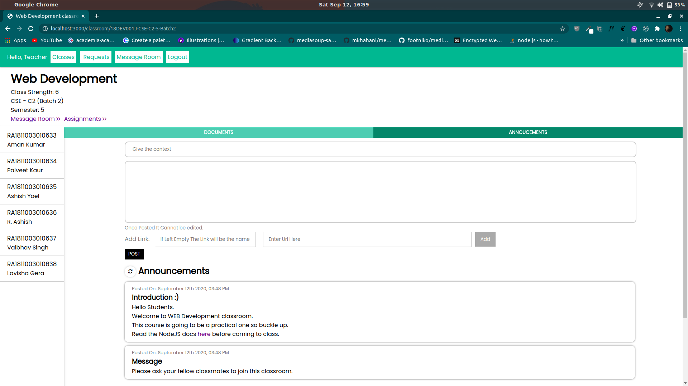
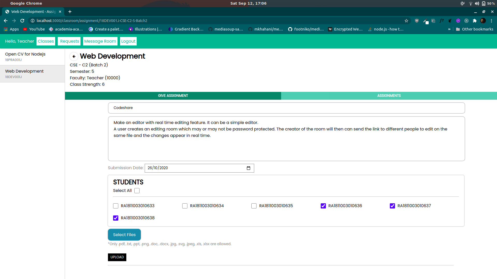
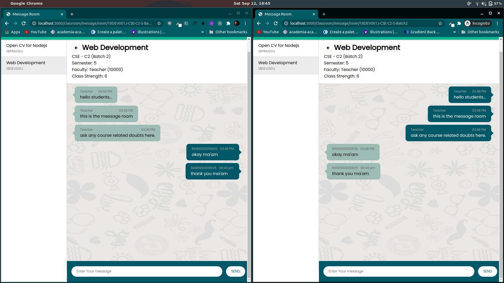
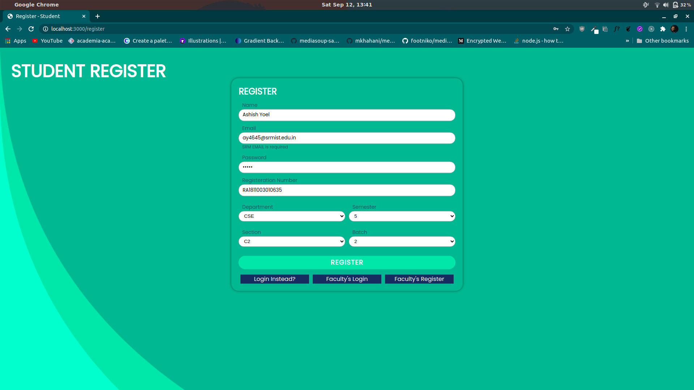
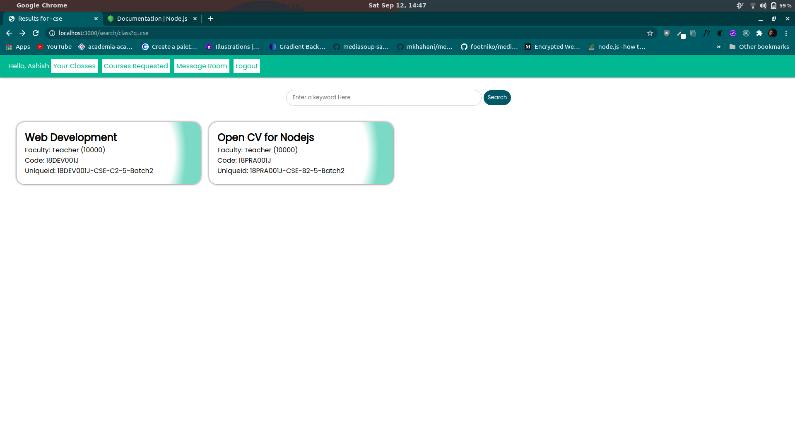

# CLASSROOM WEB APPLICATION
> THIS IS A ONLINE CLASSROOM.  TECH STACK: NODEJS, EXPRESSJS, MONGOOSE

## OVERVIEW
### TEACHER
1. SIGNUP AS A FACULTY.

2. ADD CLASSES.

3. ACCEPT THE REQUESTS OF THE STUDENTS.

4. UPLOAD DOCUMENTS AND MAKE ANNOUCEMENTS FOR AN INDIVIDUAL CLASSROOM.
    * __UPLOADING DOCUMENTS__
    
    * __ANNOUNCEMENTS__
     
5. GIVE ASSIGNMENTS TO STUDENTS.

6. COMMUNICATE WITH THE STUDENTS IN THE MESSAGE ROOM.

### STUDENT
1. SIGNUP AS A STUDENT

2. SEARCH FOR THE CLASSES AND SEND REQUESTS.
 
3. COMMUNICATE WITH THE FACULTY OF THE SUBJECT.
4. SUBMIT THE ASSIGNMENTS.

## MODULES AND DEPENDENCIES
1. __express__: Making a web server.
2. __express-session__: Storing cookies.
3. __mongoose__: For performing MongoDB queries in Nodejs.
4. __multer__: For uploading files.
5. __socket.io__: For real time message transfer.
6. __pug__: Template Engine.
7. __config__: For storing globally used variables.
8. __moment__: For manupulating time.
9. __bcryptjs__: For Hashing Password.
10. __nodemailer__: Sending Mail. 
